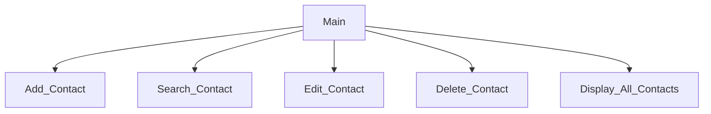

# Contact Program Chapter 6
Riley Ternes, Liam Dowell, Braxton Hartley
## Contact Program Description
The program will store the name, street adress, phone number, and email address of a person. It will be able to add contacts, search for a certain contacts info, edit that contacts info, delete a contact, and to display all of the contacts, along with an exit.
### Contact Program Flowchart

#### Function Diagrams
| `Main`    |               |  author     |
| ------------------ | ------------- | ------------ |
| `argument:type`    | takes input from the user for ____  |              |
| `time:integer`     | calculates ______  | outputs ____             |
| `name:string`      | takes input for name ___ | returns total |
***
| `Menu`    |               |  author     |
| ------------------ | ------------- | ------------ |
| `argument:type`    | takes input from the user for ____  |              |
| `time:integer`     | calculates ______  | outputs ____             |
| `name:string`      | takes input for name ___ | returns total |
***
| `Add`    |               |  author     |
| ------------------ | ------------- | ------------ |
| `argument:type`    | takes input from the user for ____  |              |
| `time:integer`     | calculates ______  | outputs ____             |
| `name:string`      | takes input for name ___ | returns total |
***
| `Search`    |               |  Braxton Hartley     |
| ------------------ | ------------- | ------------ |
| `argument: 1 input`    | takes input from the user for the contacts information that needs to be found  |   Will output the desired names info           |
***
| `Edit`    |               |  author    |
| ------------------ | ------------- | ------------ |
| `argument:type`    | takes input from the user for ____  |              |
| `time:integer`     | calculates ______  | outputs ____             |
| `name:string`      | takes input for name ___ | returns total |
***
| `Delete`    |               |  Braxton Hartley     |
| ------------------ | ------------- | ------------ |
| `argument: `    | takes input from the user for The name that they wish to be deleted  |   It will delete the desired one           |
***
| `Display`    |               |  author     |
| ------------------ | ------------- | ------------ |
| `argument:type`    | takes input from the user for ____  |              |
| `time:integer`     | calculates ______  | outputs ____             |
| `name:string`      | takes input for name ___ | returns total |
***
