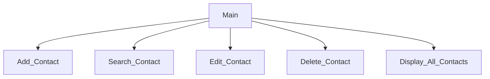

# Contact Program Chapter 6
Riley Ternes, Liam Dowell, Braxton Hartley
## Contact Program Description
The program will store the name, street adress, phone number, and email address of a person. It will be able to add contacts, search for a certain contacts info, edit that contacts info, delete a contact, and to display all of the contacts, along with an exit.
### Contact Program Flowchart

#### Function Diagrams
| `Main`    |               | Liam Dowell     |
| ------------------ | ------------- | ------------ |
| `Recieves no arguements`    | runs all of the programs such as menu, search, add, delete, and modify.  |  it outputs the programs            |
| | |            |
| || |
***
| `Menu`    |               |  Liam Dowell     |
| ------------------ | ------------- | ------------ |
| recieves no arguements    | takes input from the user for the program they want to run |   it outputs it to main so main can run the program          |
| `time:integer`     | calculates ______  | outputs ____             |
| `name:string`      | takes input for name ___ | returns total |
***
| `Add`    |               |  author     |
| ------------------ | ------------- | ------------ |
| `argument:type`    | takes input from the user for ____  |              |
| `time:integer`     | calculates ______  | outputs ____             |
| `name:string`      | takes input for name ___ | returns total |
***
| `Search`    |               |  author     |
| ------------------ | ------------- | ------------ |
| `argument:type`    | takes input from the user for ____  |              |
| `time:integer`     | calculates ______  | outputs ____             |
| `name:string`      | takes input for name ___ | returns total |
***
| `Delete`    |               |  author     |
| ------------------ | ------------- | ------------ |
| `argument:type`    | takes input from the user for ____  |              |
| `time:integer`     | calculates ______  | outputs ____             |
| `name:string`      | takes input for name ___ | returns total |
***
| `Display`    |               |  Liam Dowell    |
| ------------------ | ------------- | ------------ |
| it recieves no arguements    | it takes no inputs  |  it outputs all of the contacts stored            |
| `time:integer`     | calculates ______  | outputs ____             |
| `name:string`      | takes input for name ___ | returns total |
***
